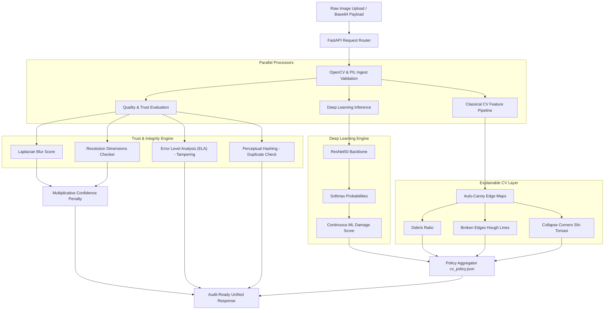

# Jagruk CV: Trust-Aware Disaster Damage Assessment Service
### 🎓 Ultimate Technical Interview Preparation Guide & System Architecture Blueprint

---

## 📌 Section 1: Project Overview & Hybrid Architectural Vision

**Jagruk CV** is a production-grade, trust-aware Computer Vision (CV) microservice designed for high-resolution post-disaster structural damage assessment. It is engineered to analyze aerial (drone, satellite) imagery of building structures and estimate damage severity across four distinct levels: `no_damage`, `minor_damage`, `major_damage`, and `destroyed`.

### 🧠 The Core Interview Pitch: Why a "Hybrid" Architecture?
If a technical interviewer asks: *"Why did you combine Deep Learning with Classical Computer Vision instead of using a pure Deep Learning system?"*, your answer should highlight **auditability, robust explainability, and trust-awareness**:

1. **Deterministic Explanations**: Deep Neural Networks (DNNs) are notorious black boxes. In regulatory or insurance claims processing, a classification of "Destroyed" cannot be justified by an opaque internal activation map (like Grad-CAM) alone. Jagruk CV combines deep learning's perception power with classical OpenCV edge, corner, and line segmentation to produce **explicit, auditable, mathematically-derived features** (Debris Ratio, Broken Edge score, Corner Collapse density).
2. **Zero-Trust Signal Isolation**: DNNs can be easily fooled by blurry, low-resolution, duplicate, or digitally manipulated imagery. Jagruk CV integrates a **Trust & Integrity Layer** directly into the inference pipeline, computing dynamic confidence penalties (for blur and low resolution) and running fraud analysis (Error Level Analysis for compression tampering, and perceptual hashing to detect duplicate image submission).
3. **Optimized for Single-Image Inference**: Most pre/post-disaster comparison systems fail in the field because pre-disaster satellite passes are unavailable, outdated, or misaligned due to camera angles. Jagruk CV is strictly engineered for **single post-disaster image inputs**, making it highly portable for real-time drone streams or rapid ad-hoc field uploads.

---

## 🗺️ Section 2: End-to-End System Workflow

The following pipeline details the sequence of operations executed when an image is sent to the `/cv/analyze` endpoint.

> [!NOTE]
> **ASGI Lifespan Integration**: The FastAPI application uses standard modern `lifespan` context-managers to load deep learning models (`models/best_model.pth`) and customize policy specifications (`cv_policy.json`) cleanly on server start and release resources on shutdown.



---

## 🗄️ Section 3: Dataset Ingestion & Advanced Preprocessing Pipeline

The model was trained on building crops derived from the production benchmark **xBD Dataset** (the gold standard for disaster damage classification).

### 🛠️ Technical Interview Deep-Dive: 16-bit GeoTIFF Loading Anti-Pattern
**Interview Question:** *"What are the engineering challenges when dealing with raw satellite imagery (GeoTIFFs), and how did you resolve them?"*

* **The Anti-Pattern**: Standard OpenCV (`cv2.imread`) is optimized for 8-bit, 3-channel standard images (sRGB). Loading 16-bit geospatial GeoTIFFs using `cv2.imread` frequently yields a **plain black canvas** or single-channel errors because the pixel values occupy a dynamic range outside standard RGB boundaries, and satellite images contain extra bands (like Near-Infrared).
* **The Solution**: We utilized `rasterio` to read the specific bands (Red, Green, Blue) from the multispectral GeoTIFF, transpose the coordinate axes from channel-first `(C, H, W)` to channel-last `(H, W, C)`, and execute a dynamic range compression:
  1. **Percentile Clipping (1% - 99%)**: To eliminate sensor outliers, hot pixels, and extreme atmospheric reflections, float values are clipped:
     $$I_{\text{clipped}} = \text{clamp}(I, P_{0.01}, P_{0.99})$$
  2. **Min-Max Mapping**: Scaled the remaining dynamic range linearly into a standard float space, multiplied by `255.0`, and cast down to standard `uint8` resolution:
     $$I_{\text{norm}} = \frac{I_{\text{clipped}} - P_{0.01}}{P_{0.99} - P_{0.01}} \times 255.0$$
  3. **Color Space Alignment**: Converted channel orders from RGB to BGR for OpenCV standard compatibility:
     ```python
     img_bgr = cv2.cvtColor(img_uint8, cv2.COLOR_RGB2BGR)
     ```

### 🖼️ Full-Image Alignment & Label Aggregation
1. **No-Cropping Pipeline**: Rather than slicing individual buildings based on complex geometry shapes (which introduces training-evaluation mismatches for ad-hoc user uploads), Jagruk CV standardizes the **full post-disaster satellite image** (resized/normalized directly to $224 \times 224$).
2. **Image-Level Label Aggregation**: Since a single $1024 \times 1024$ satellite image contains multiple buildings, the overall ground truth damage label is computed as the **maximum damage severity** among all building footprints inside that image's JSON annotations. The severity ranks are defined as:
   $$\text{destroyed} > \text{major\_damage} > \text{minor\_damage} > \text{no\_damage}$$
   If no building footprints are present, the image label defaults to `no_damage`.
3. **Traceable Filename Design**: Implemented structured, audit-ready filenames containing the dataset split and origin GeoTIFF:
   `{split}_{source_tif_clean}.png`
   *Example: `tier3_joplin-tornado_00000003_post_disaster.png`*
4. **Dataset Visual Auditing**: An automated visual checker scans the preprocessed dataset, calculating image texture standard deviations and mean brightness to flag empty or dark inputs (`mean_val < 15.0`). It exports up to 20 random samples to a `previews` directory for human-in-the-loop validation.

---

## ⚡ Section 4: Deep Learning Perception Layer (ML Engine)

### 🏗️ Network Architecture
The perception backbone is a **ResNet50** convolutional neural network architecture.
* **Weights**: Initialized with standard ImageNet weights (`models.resnet50(weights='DEFAULT')`).
* **Header Modification**: The final fully connected classification head (`self.resnet.fc`) was replaced with a linear layer mapped to **4 output classes** corresponding to damage severity:
  ```python
  num_ftrs = self.resnet.fc.in_features
  self.resnet.fc = nn.Linear(num_ftrs, num_classes) # num_classes = 4
  ```

### 🏋️ Training Dynamics & Combating Class Imbalance
**Interview Question:** *"Disaster datasets are highly imbalanced. Most buildings have 'no damage' while 'destroyed' crops are rare. How did you stabilize training?"*

1. **Class-Weighted Cross-Entropy Loss**: We dynamically calculate frequencies in the training subset and apply inverse frequency weights inside the loss function. The weight for class $i$ is:
   $$w_i = \frac{N_{\text{total}}}{C \times N_i}$$
   Where $N_{\text{total}}$ is total crops, $C$ is the number of classes (4), and $N_i$ is the count of class $i$. This prevents the model from developing a strong majority-class bias.
2. **Optimization**:
   - **Optimizer**: Adam with a conservative learning rate of $\eta = 10^{-4}$ to ensure steady convergence.
   - **Scheduler**: `ReduceLROnPlateau` monitoring **Macro-F1 Score** (patience = 2, factor = 0.1). *Why Macro-F1?* Because standard accuracy ignores tail-end performance on critical classes like "destroyed". Macro-F1 treats all classes equally, guaranteeing balanced learning.
3. **Moderate Regularization**: Apply controlled augmentations to prevent overfitting:
   - Random Horizontal Flips ($p=0.5$).
   - Color Jitter (brightness=0.2, contrast=0.2).
   - Gaussian Blur (kernel size $3 \times 3$, $\sigma \in [0.1, 2.0]$).

### 🔢 Continuous ML Damage Score Calculation
**Interview Question:** *"How did you convert the classification probabilities of the ResNet50 model into a continuous damage index?"*

Instead of simply using the highest-probability class, we treat the damage severity categories as a continuous spectrum. We assign a severity weight to each class:
* $W_{0}$ (`no_damage`) = $0.0$
* $W_{1}$ (`minor_damage`) = $0.33$
* $W_{2}$ (`major_damage`) = $0.66$
* $W_{3}$ (`destroyed`) = $1.0$

The continuous model damage score $S_{ml}$ is calculated as the **expected value** (dot product of probabilities and weights):
$$S_{ml} = \sum_{i=0}^3 P_i \times W_i = (P_{no} \times 0.0) + (P_{minor} \times 0.33) + (P_{major} \times 0.66) + (P_{destroyed} \times 1.0)$$

*Example*: If ResNet50 outputs class probabilities of `[0.05, 0.15, 0.50, 0.30]`, the continuous score is:
$$S_{ml} = (0.05 \times 0) + (0.15 \times 0.33) + (0.50 \times 0.66) + (0.30 \times 1.0) = 0.0495 + 0.330 + 0.300 = 0.6795$$

---

## 🛠️ Section 5: Explainable Classical CV Feature Layer

To prevent reliance on internal black-box states, three explainable features are computed explicitly in OpenCV.

### 1️⃣ Dynamic Edge Density & Debris Ratio
* **Concept**: Severe structural damage is characterized by high-frequency textures (rubble, concrete fragments). 
* **Dynamic Edge Detection (Auto-Canny)**: Standard Canny edge detection requires manual threshold tuning. Jagruk CV uses the **Median-Adaptive Thresholding (Auto-Canny)** algorithm. Based on the median grayscale intensity $v$ of the crop and a standard spread parameter $\sigma = 0.33$:
  $$\text{lower-threshold} = \max(0, (1.0 - \sigma) \times v)$$
  $$\text{upper-threshold} = \min(255, (1.0 + \sigma) \times v)$$
* **Laplacian Variance Integration**: Standard edge density doesn't distinguish between clean edges and micro-textured rubble. We calculate the Laplacian variance (high values indicate massive high-frequency detail) and normalize it by capping at 500:
  $$\text{Var}_{\text{norm}} = \min\left(1.0, \frac{\text{Var}(\Delta I)}{500.0}\right)$$
* **The Score**: Combined via a weighted formula:
  $$S_{debris} = (\text{Edge Density} \times 0.7) + (\text{Var}_{\text{norm}} \times 0.3)$$

### 2️⃣ Structural Discontinuity (Broken Edges)
* **Concept**: Pristine buildings have long, continuous architectural lines (roof edges, walls). Damaged buildings have shattered, fragmented, short lines.
* **Line Detection**: We run the **Probabilistic Hough Line Transform** (`cv2.HoughLinesP`) on the Auto-Canny edge map with parameters:
  - $\rho = 1$ pixel, $\theta = 1^\circ$ (accumulator resolutions)
  - $\text{Threshold} = 20$ accumulator votes
  - $\text{minLineLength} = 10$ pixels (rejects small debris noise)
  - $\text{maxLineGap} = 5$ pixels (connects disjointed structural segments)
* **Mathematical Assessment**: Sum the lengths of all detected segments and divide by segment count to calculate the average length $\bar{L}$. Normalize this against the image diagonal $L_{\text{diag}} = \sqrt{224^2 + 224^2} \approx 316.78\text{px}$:
  $$S_{edges} = 1.0 - \frac{\bar{L}}{L_{\text{diag}}}$$
  *Interpretation*: If the building is structurally intact, it has long straight segments, making $\bar{L}$ high and $S_{edges}$ low. If the building is shattered, it has tiny fragmented lines or none at all, pushing $S_{edges}$ toward `1.0`.

### 3️⃣ Corner Density Collapse
* **Concept**: Crumbling geography, debris piles, and collapsed structural surfaces manifest as high-density corner clusters.
* **Corner Detection**: Utilizes the **Shi-Tomasi Corner Detector** (`cv2.goodFeaturesToTrack`), evaluating eigenvalues of the local structural intensity gradient:
  - $\text{maxCorners} = 1000$
  - $\text{qualityLevel} = 0.01$ (rejects weak peaks)
  - $\text{minDistance} = 5$ pixels
* **Normalization**: The number of corners detected ($N_{corners}$) is normalized against a hard ceiling of 500 (representing a highly cluttered rubble field):
  $$S_{collapse} = \min\left(1.0, \frac{N_{corners}}{500.0}\right)$$

> [!IMPORTANT]
> **Sobel Kernel Smoothing Test Caveat**  
> During unit testing with synthetic images, corner detection on small dimensions (e.g. $100 \times 100$) can fail because the Sobel kernels inside OpenCV's corner tracker will smooth out single-pixel gradient transitions, leading to self-canceling edges. To prevent this, tests must use distinct block structures of at least **$20 \times 20$ pixels** to generate crisp, un-smoothed gradients.

### 🔄 Optimal Sharing Pipeline
To minimize compute overhead, the classical CV pipeline runs grayscale conversion and Auto-Canny edge extraction **exactly once**, sharing the edge array between the Debris and Broken Edge engines.

---

## 🔒 Section 6: Trust, Integrity, and Quality Adjustments

To ensure downstream scoring engines receive highly reliable metrics, inputs undergo real-time quality and integrity grading.

### 📉 Multiplicative Confidence Adjustments
Raw model probabilities ($P_{pred}$) are penalized when the input image is blurry or lacks sufficient resolution.

1. **Blur Penalty**: Computes the variance of the Laplacian of the image $\sigma_{Lap}^2$. If it falls below a threshold of $100.0$ (indicating blur), a linear penalty is calculated:
   $$\text{BlurFactor} = \min\left(1.0, \frac{\sigma_{Lap}^2}{100.0}\right)$$
2. **Resolution Penalty**: Standardizes inputs. If the minimum dimension of the uploaded image is smaller than the model input resolution ($224\text{px}$), it is penalized:
   $$\text{ResolutionFactor} = \min\left(1.0, \frac{\min(W, H)}{224.0}\right)$$
3. **Final Adjusted Confidence**: Applied multiplicatively:
   $$\text{Confidence}_{\text{adjusted}} = P_{pred} \times \text{BlurFactor} \times \text{ResolutionFactor}$$
4. **Confidence Floor**: To prevent a zero probability from breaking downstream Bayesian fusion systems, the final value is clamped to a safety floor:
   $$\text{Confidence}_{\text{final}} = \max(0.05, \text{Confidence}_{\text{adjusted}})$$

### 🕵️ Image Tampering & Manipulation (Error Level Analysis)
**Error Level Analysis (ELA)** detects digital modification (e.g., photoshopping damage indicators onto an intact house).
* **The Method**: JPEG compression operates on $8 \times 8$ pixel grids. If an image is manipulated, the modified area has a different error margin than the rest of the image.
* **The Algorithm**:
  1. Compresses the uploaded image in-memory at JPEG quality = 90.
  2. Decodes it back to standard BGR.
  3. Computes the absolute pixel-by-pixel difference:
     $$\text{Diff} = |I_{\text{original}} - I_{\text{recompressed}}|$$
  4. Calculates the normalized ELA suspicion score:
     $$S_{ELA} = \frac{\text{Mean}(\text{Diff})}{255.0}$$

### 👥 Duplicate Prevention (Perceptual Hashing)
To prevent bad actors from submitting the same image multiple times (duplicate billing fraud):
* **The Method**: Submits the image to a Discrete Cosine Transform (DCT) based **Perceptual Hashing (pHash)** algorithm, producing a 64-bit fingerprint of visual layout.
* **Comparison**: The Hamming distance (count of differing bits) between a new image and existing submissions is calculated. If the distance is $\le 10$, it is flagged as suspicious duplicate.

---

## 🎛️ Section 7: Policy-Driven Scoring Engine

The scoring engine aggregates deep learning predictions with classical CV indicators according to a configuration file (`cv_policy.json`).

### 🧮 Weighted Scoring Aggregation Formula
The final damage score $S_{final}$ is computed as:
$$S_{final} = (S_{ml} \times W_{ml}) + (S_{cv} \times W_{cv})$$

Where the default policy weights are:
* $W_{ml}$ (Model Weight) = $0.7$
* $W_{cv}$ (Classical CV Weight) = $0.3$

And $S_{cv}$ is the arithmetic mean of explainable classical features:
$$S_{cv} = \frac{S_{debris} + S_{edges} + S_{collapse}}{3}$$

### 🏷️ Damage Severity Boundaries
Based on the final continuous score $S_{final} \in [0.0, 1.0]$, structural damage is binned into severity levels:
* $[0.00, 0.25)$ $\rightarrow$ `no_damage`
* $[0.25, 0.50)$ $\rightarrow$ `minor_damage`
* $[0.50, 0.75)$ $\rightarrow$ `major_damage`
* $[0.75, 1.00]$ $\rightarrow$ `destroyed`

### 📋 Audit-Ready Nested JSON Response Schema
The API output is structured to satisfy downstream aggregation systems, containing a complete execution breakdown under the `explain` key:

```json
{
  "report_id": "7df48fb3-e69d-425b-80c1-3701c905391e",
  "damage_score": 0.7245,
  "damage_label": "major_damage",
  "confidence": 0.8841,
  "fake_image_score": 0.0125,
  "explain": {
    "debris_ratio": 0.5124,
    "broken_edges": 0.6128,
    "collapse_features": 0.4502,
    "model_probability": 0.9204,
    "quality_checks": {
      "resolution_px": [1024, 768],
      "blur_score": 242.4512
    },
    "fake_checks": {
      "ela": 0.0125,
      "phash_sim": 0.0
    }
  },
  "model_version": "cv_v1.0",
  "policy_version": "cv_policy_v1.0",
  "timestamp": "2026-05-22T10:28:37Z"
}
```

---

## 🧪 Section 8: Testing & Verification Framework

Jagruk CV implements standard unit testing with **46 green-passing unit & integration tests**, covering all layers of the system.

### 🚀 Running the Test Suite
Because the source files live inside the `src/` directory, running raw `pytest` will result in a `ModuleNotFoundError` for `cv_service`. You **MUST** set the python search path prefix before execution:

* **Windows PowerShell (Default)**:
  ```powershell
  $env:PYTHONPATH="src"; pytest -v
  ```
* **Linux / macOS Terminal**:
  ```bash
  PYTHONPATH=src pytest -v
  ```

---

## 🧠 Section 9: Top High-Yield Interview Q&As

Use these questions and answers to prepare for your interview. They cover common computer vision concepts and system design questions.

#### Q1: "Why did you use ResNet50 instead of a newer model like Vision Transformers (ViT)?"
**A:** "For disaster response systems, operational efficiency is critical. ResNet50 is extremely lightweight compared to ViT or large ConvNeXt models, enabling fast inference on edge CPUs or mobile ground terminals without requiring high-end GPUs. It also converges very reliably on smaller training subsets compared to data-hungry Transformers, which lack inductive biases like translation invariance."

#### Q2: "How does Error Level Analysis (ELA) work mathematically, and when does it fail?"
**A:** "ELA compresses an image at a specific quality level (e.g. 90%) and calculates the absolute pixel-by-pixel difference against the source image. In a single-compressed image, the differences will be uniform across the spatial area. In an image containing composites or digital manipulation, the altered regions will have different compression grids and show up as higher-intensity error points, driving up the mean difference score. It can fail if the image is heavily post-processed, resized, or saved in a lossless format like PNG after editing, which flattens the JPEG compression history."

#### Q3: "Why did you choose Shi-Tomasi corner detection over Harris Corner detection?"
**A:** "Harris corner detection uses a score calculation based on the trace and determinant of the structure tensor matrix $M$: $R = \det(M) - k(\text{Trace}(M))^2$. Shi-Tomasi simplifies this by directly evaluating the minimum eigenvalue: $R = \min(\lambda_1, \lambda_2)$. It has been shown to produce more stable and mathematically consistent corner locations, which is ideal for isolating structural rubble bounds."

#### Q4: "How does a Perceptual Hash (pHash) differ from a Cryptographic Hash (like MD5 or SHA-256)?"
**A:** "Cryptographic hashes are designed to be extremely sensitive to change; altering a single pixel changes the hash output entirely (the avalanche effect). In contrast, a perceptual hash is designed to remain stable under minor visual changes like scaling, minor compression, or watermark additions. MD5 helps verify file integrity, while pHash measures semantic visual similarity. It works by scaling the image down (usually $32 \times 32$), applying a Discrete Cosine Transform (DCT), keeping the low frequencies, and comparing individual frequency values to the median to generate a 64-bit binary hash."


#### Q5: "If your model outputs a high probability but the input image is highly blurred, what happens to the confidence and score?"
**A:** "The scoring engine remains stable. The blur score (Laplacian variance) will fall below the threshold of $100.0$, producing a small `blur_factor` (e.g. $0.2$). The multiplicative confidence adjuster will scale the model's confidence down from its high value (e.g. $0.95$) to a heavily penalized confidence score ($0.19$). The final damage score remains unaffected, but downstream fusion engines are alerted that the confidence in this prediction is extremely low due to low input quality."

---

## 🚀 Section 10: Execution Guide — Exact Commands

### A. Preprocess Dataset (Convert raw post-disaster xBD GeoTIFFs to full-image dataset)
```powershell
# Full rebuild (wipe old data, preprocess full-image, auto-split)
python scripts/preprocess_xbd.py --wipe yes

# Append new images without wiping, then split
python scripts/preprocess_xbd.py --wipe no

# Quick test run (process only 5 TIFF files)
python scripts/preprocess_xbd.py --wipe yes --limit 5

# Preprocess images without splitting (split manually later)
python scripts/preprocess_xbd.py --wipe yes --skip-split
python scripts/split_dataset.py --data-dir data/processed/dataset --force
```

### B. Train Model
```powershell
# Full training (all data, 10 epochs, CPU)
$env:PYTHONPATH="src"; python scripts/train.py --data-dir data/processed/dataset --epochs 10

# GPU training with larger batch
$env:PYTHONPATH="src"; python scripts/train.py --data-dir data/processed/dataset --epochs 20 --batch-size 64

# Quick dry-run (100 samples, 2 epochs)
$env:PYTHONPATH="src"; python scripts/train.py --data-dir data/processed/dataset --epochs 2 --subset-size 100
```

### C. Evaluate Model (Test Split Only)
```powershell
# Evaluate on held-out test set
$env:PYTHONPATH="src"; python scripts/evaluate.py --data-dir data/processed/dataset

# Evaluate with custom model path
$env:PYTHONPATH="src"; python scripts/evaluate.py --data-dir data/processed/dataset --model-path models/best_model.pth
```
Outputs: `reports/test_metrics.json`, `reports/confusion_matrix.png`

### D. Inspect Dataset
```powershell
# Full dataset inspection with previews
$env:PYTHONPATH="src"; python scripts/inspect_dataset.py --data-dir data/processed/dataset

# Export 10 preview images per class
$env:PYTHONPATH="src"; python scripts/inspect_dataset.py --data-dir data/processed/dataset --preview-count 10
```

### E. Run API Server
```powershell
# Start FastAPI server (requires trained model at models/best_model.pth)
$env:PYTHONPATH="src"; uvicorn cv_service.api.main:app --host 0.0.0.0 --port 8000

# Health check
curl http://127.0.0.1:8000/health
```

### F. Test Inference
```powershell
# Multipart file upload
curl.exe -X POST -F "file=@path/to/post_disaster_image.png" -F "report_id=test-001" http://127.0.0.1:8000/cv/analyze

# Base64 JSON payload (PowerShell)
$bytes = [System.IO.File]::ReadAllBytes("path/to/post_disaster_image.png")
$b64 = [System.Convert]::ToBase64String($bytes)
$body = @{ report_id = "test-002"; image_base64 = $b64 } | ConvertTo-Json
Invoke-RestMethod -Uri "http://127.0.0.1:8000/cv/analyze" -Method POST -Body $body -ContentType "application/json"
```

### G. Run Unit Tests
```powershell
# Full test suite (46 tests)
$env:PYTHONPATH="src"; pytest -v

# Run specific test module
$env:PYTHONPATH="src"; pytest tests/test_models/test_training.py -v
```

---

## ⚠️ Section 11: MVP Scope & Input Domain Disclaimer

> [!IMPORTANT]
> **Jagruk CV MVP is designed exclusively for aerial/drone/satellite post-disaster imagery.**

### Supported Input Domains
* ✅ Satellite imagery (e.g., Maxar, Planet Labs)
* ✅ Drone/UAV aerial photography
* ✅ Helicopter reconnaissance imagery
* ✅ High-altitude aerial survey photos

### NOT Supported (Out of Scope for MVP)
* ❌ Arbitrary mobile phone photos
* ❌ Indoor/interior damage scenes
* ❌ Selfies or ground-level pedestrian photos
* ❌ Generic internet-sourced building images
* ❌ Pre/post-disaster change detection (comparative inference)

### Architectural Commitment
The MVP processes a **single current-state post-disaster image** and outputs a structural severity estimate. It does **NOT** perform pre/post comparison change detection. The xBD dataset is used purely as supervised training labels — only **post-disaster imagery** is used for model training.
